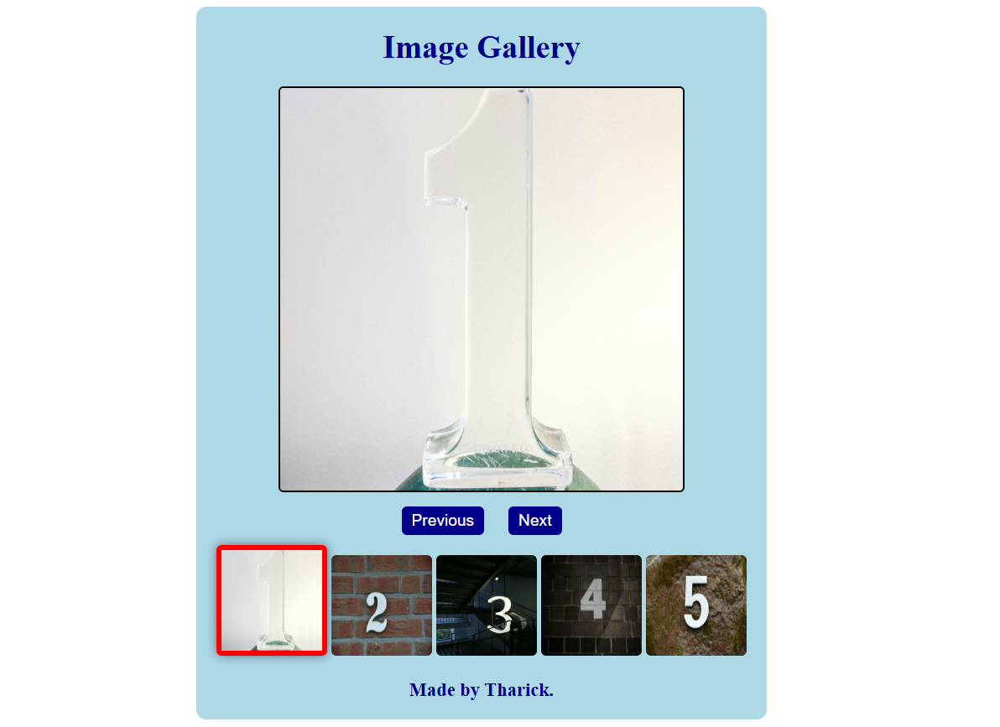

# 🖼️ Image Gallery Project

## 📘 Overview

This is a simple and interactive **Image Gallery** built using **HTML**, **CSS**, and **JavaScript**.  
The gallery allows users to browse through images, click on thumbnails to view them in a larger display, and visually see which image is currently active.

---

## 🚀 Features

- ➡️ **Next / Previous Navigation:** Easily browse through all images.
- 🖱️ **Clickable Thumbnails:** Instantly display the selected image.
- ✨ **Active Image Highlighting:** The currently active thumbnail is highlighted with a red border and shadow.
- 🎨 **Responsive & Clean Design:** A simple, centered layout that works on all devices.

---

## 🧠 What I Learned

Through this project, I improved my understanding of:

- DOM Manipulation using **JavaScript**
- Event handling with **addEventListener**
- Managing state (`currentIndex`) for interactive components
- Styling active elements dynamically with **CSS classes**
- Structuring small web projects effectively

---

## 🧩 Technologies Used

- **HTML5** – Structure of the webpage
- **CSS3** – Styling and layout
- **JavaScript (ES6)** – Interactivity and functionality

---

## 🗂️ Project Structure

Image-Gallery/
│
├── index.html # Main HTML file
├── style.css # Styling for the gallery
├── script.js # JavaScript logic
└── images/ # Folder containing images
├── one.jpg
├── two.jpg
├── three.jpg
├── four.jpg
└── five.jpg

---

## ⚙️ How to Run

1. Clone or download this repository.
2. Open the `index.html` file in any modern web browser.
3. Use the **Previous** and **Next** buttons or click on thumbnails to explore the gallery.

---

## 📸 Preview

---

## 👨‍💻 Author

**Tharick**  
💼 _Aspiring Front-End Developer_  
🔗 [LinkedIn](https://www.linkedin.com/in/mdtharick/)

---

## 🏷️ License

This project is open-source and free to use for learning purposes.

---

### 🌟 Keep Building & Keep Learning!

Each project brings me closer to mastering front-end development and understanding how JavaScript brings life to static pages.
